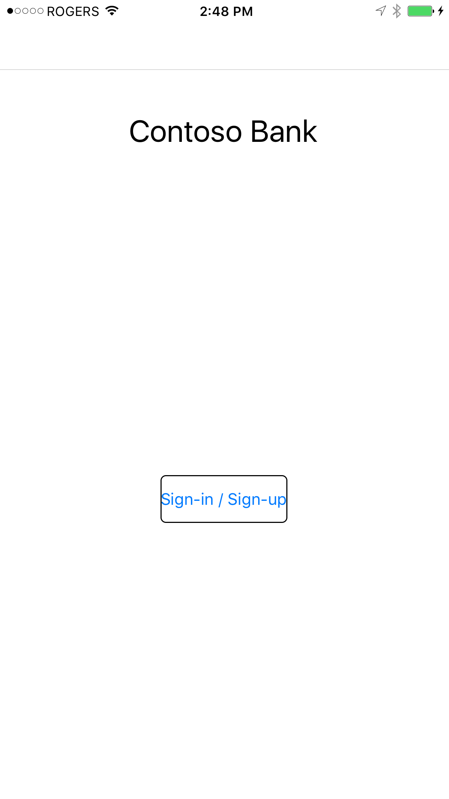
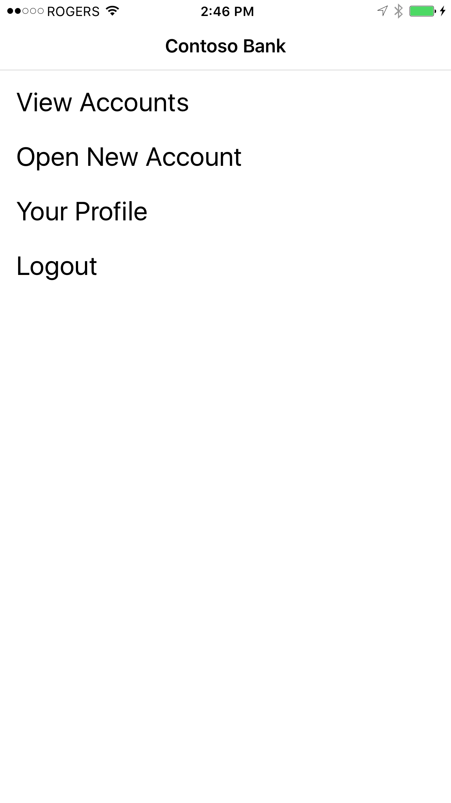
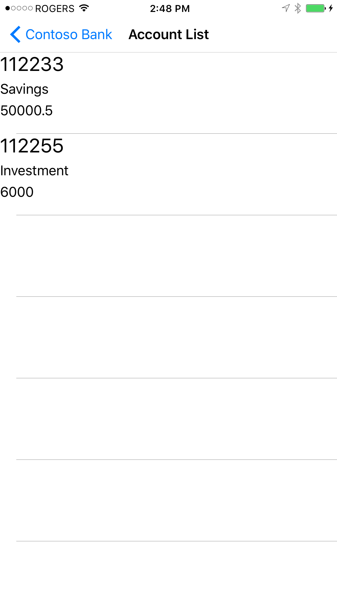
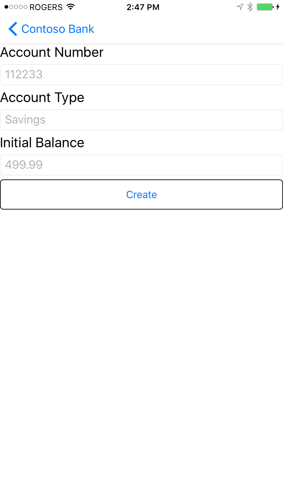
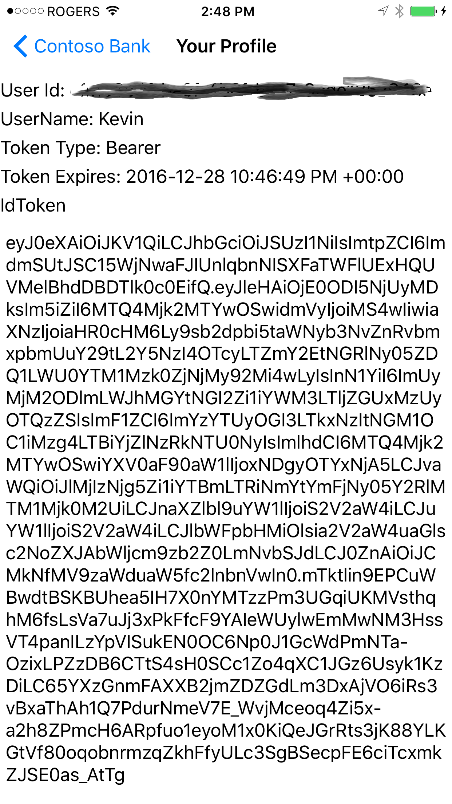

# Contoso-Bank
##Business Problem
Business to consumer (B2C) applications often require the ability to allow new users to sign-up through a mobile application using Social Networking providers such as Facebook, Google and so on. Once signed-up and signed-in, the mobile application generally communicates with the application back-end using APIs.

At the surface this sounds simple. However, there are in fact many services and technlogies required behind the scenes to ensure a seamless sign-up and sign-in user experience. These include:

- Identity Provider authentication and authorization services;
- Protocols such as HTTPS, OAuth2, OpenID Connect;
- APIs (both your own and 3rd party APIs); and 
- Mobile platform-specific code (iOS, Android etc.). 

Fortunately Microsoft has put together a suite of tools and services to make developing end-to-end B2C applications easier.

##Solution Overview
The Contoso Bank application is an example, end-to-end solution involving a Mobile App that allows users to sign-up and then sign-in to the Contoso mobile banking application. Users can sign-up with an email address/password of their choosing (these are stored in Azure Active Directory B2C), or using a social network account from Google, Facebook, etc. 

Once signed-up, the user can sign-in (authenticate) using the mobile application and the identity provider selected during the sign-up process. User authentication is accomplished using OpenID Connect and OAuth 2 over HTTPS. The benefit of using a 3rd party identity provider is they (e.g. Microsoft, Facebook, Google etc.) are responsible for storing the user's credentials securely, thereby reducing Contoso's liability and responsibility for storing these. In fact, the example Contoso Bank application never sees the user's username or password. Usernames and passwords are completely the responsibility of the identity providers using claims-based authentication and authorization inherent in OAuth 2 and OpenID Connect. 

Upon signing in to the mobile application, a bearer token is assigned behind-the-scenes to the user, which allows the user to securely lookup their bank accounts and balances. This is information is retrieved from a RESTful API secured by Azure Active Directory B2C (or other identity providers). The Contoso Bank REST API receives the bearer token from the mobile application as part of the HTTPS request header and uses that to ensure the consumer is authorized to view the data. Normally this information is stored in a database such as Azure SQL Database and secured using Row Level Security. But to keep things simple, the Contoso Bank API stores this data in memory and does not require a database.

##Solution Components
###Mobile Application
- The mobile application was written in C# using Xamarin.Forms for a single code base supporting iOS, Android, and Windows UWP.
- Most of the code is using MVVM pattern, to minimize code-behind and make unit testing easier.
- A Windows 10 computer with Visual Studio 2015, Update 3 and Xamarin installed.
- A Mac OS X with XCode 8.1 and Xamarin Studio 6.1.2
- [Microsoft Authentication Library (MSAL)] (https://www.nuget.org/packages/Microsoft.Identity.Client/1.0.304142221-alpha) library (Nuget Package: ```Microsoft.Identity.Client``` (Note, this is a pre-release)
- Microsoft Azure Active Directory B2C (same tenant use by the API)
- Update the following in the ```App.xaml.cs``` file:

```
// TODO: Add your Azure AD B2C tenant information.
public static string ClientId = "<client ID of application registered in AAD B2C>";
public static string SignUpSignInPolicy = "B2C_1_signin_signup";
public static string[] Scopes = { ClientId };
public static string Authority = "https://login.microsoftonline.com/<tenant>.onmicrosoft.com/";
public static string ApiBaseURL = "https://<apiurl>.azurewebsites.net";
```
The following are screen shots of the mobile application.

<p align="center">
  
  
  
  
    
</p>

###REST API
- The API was written in C# using ASP.NET 4.5.2 WebAPI using the ```ApiController```.
- The ASP.NET MVC website simply exists for hosting the API documentation, including links to this GibHub repo, and links to the Swagger metadata.
- [Swagger] is added through the ```Swashbuckle``` NuGet package (https://www.nuget.org/packages/Swashbuckle/)
- The API is published to Azure App Service as an [API App] (https://azure.microsoft.com/en-us/services/app-service/api/)
- The API is protected by enabling Easy Auth on the Azure App Service hosting the API and configuring it to use Microsoft Azure Active Directory B2C (same tenant use by the mobile application)
- Once you've published the API to Azure App Service, you can manually interact with the API using Swagger by browsing to https://someurl.azurewebsites.net/swagger. If you've already enabled Easy Auth, you will need to sign-up (create an account in AAD B2C) and then sign-in to use the API. 
- A sample of the Contose Bank API has been published at [https://contosobankapi.azurewebsites.net/] (https://contosobankapi.azurewebsites.net/). You will need to click the link and sign-up first.

###AAD B2C
Follow Chris Gillum's excellent blog post on configuring Azure App Service with Easy Auth and [AAD B2C] (https://azure.microsoft.com/en-us/services/active-directory-b2c/). See reference 1 below. 

AAD B2C is a highly available, global, identity management service for consumer-facing applications that scales to hundreds of millions of identities. It can be easily integrated across mobile and web platforms. Your consumers can log on to all your applications through fully customizable experiences by using their existing social accounts or by creating new credentials.

Easy Auth is an Azure App Service feature which basically places an authentication layer in front of an App Service, such as a Web App or API, with no changes to your application code. 

Combining AAD B2C and Easy Auth allows you to quickly secure your Mobile backend for consumer-facing apps (apps that allow the consumer to sign-up themselves).

For the Contoso Bank API you will see there is no authentication code in the API source code. This is entirely handled by Easy Auth. Only '''((ClaimsIdentity)User.Identity).FindFirst(ClaimTypes.NameIdentifier).Value;''' was used in the ```AccountsController.cs``` to filter API responses by UserId so User A can't see User B's data, and vice-versa. 

The example code assumes you've setup AAD B2C for "Local" accounts. Meaning, a user can sign-up using a username/pwd or email/pwd (which are stored in AAD B2C) and social network logins are disable. But there is nothing preventing you from enabling and using social network logins.

Easy Auth is enabled on the Contoso Bank API and is configured to authenticate against the same AAD B2C tenant used by the mobile application. 

A few important points:
- Ensure you append ```“/.auth/login/aad/callback``` to the Reply URL when registering your application with AAD B2C.
- Use a single AAD B2C sign-up / sign-in policy, rather than separate sign-up and sign-in policies.
- Azure App Service Easy Auth supports social network providers, as does AAD B2C. Don't mix the two. See Chris' article for differences between the two (see reference 1 below).
- AAD B2C is NOT like AAD. It uses the new v2 endpoints, requires MSAL (rather than ADAL) etc. So when reading up on AAD B2C, make sure you are not reading the AAD documentation, but rather the AAD B2C documentation. See reference 2.

##Release Notes
- A demo instance of the Web API is published at [https://contosobankapi.azurewebsites.net/] (http://contosobankapi.azurewebsites.net/)
- When logging into the demo site instance for the first time, proceed through the AAD B2C sign-up process to create your user account in the AAD B2C tenant. Once you have created your account, you can view the API documentation at [https://contosobankapi.azurewebsites.net/] (http://contosobankapi.azurewebsites.net/) and the Swagger at [https://contosobankapi.azurewebsites.net/swagger] (http://contosobankapi.azurewebsites.net/swagger)
- By default AAD B2C returns an [ID token] (https://docs.microsoft.com/en-us/azure/active-directory-b2c/active-directory-b2c-reference-tokens) with a 60 minute expiry. This can be increased in AAD B2C. In addition, you can call AcquireTokenSilentAsync when the user navigates to a page or pulls down to refresh a page to refresh the token. MSAL opaquely handles refresh tokens for you. The following code block illustrates this.

```
 protected override async void OnAppearing()
  {
      base.OnAppearing();

      try
      {
          AuthenticationResult ar = await App.AuthenticationClient.AcquireTokenSilentAsync(App.Scopes,
           string.Empty,
           App.Authority,
           App.SignUpSignInPolicy,
           false);
      }
      catch (Exception ee)
      {
          DisplayAlert("An error has occurred", "Exception message: " + ee.Message, "Dismiss");
          App.AuthenticationClient.UserTokenCache.Clear(App.AuthenticationClient.ClientId);
          Navigation.PushAsync(new LoginPage());
      }
  }
```

##References
1. [App Service Easy Auth and Azure AD B2C] (https://cgillum.tech/2016/05/27/app-service-auth-and-azure-ad-b2c/)
2. [AAD B2C Documentation] (https://docs.microsoft.com/en-us/azure/active-directory-b2c/)
3. [Integrate Azure AD B2C into a Xamarin forms app using MSAL] (https://github.com/Azure-Samples/active-directory-b2c-xamarin-native)
4. [Integrate Microsoft identity and the Microsoft Graph into a Xamarin forms app using MSAL] (https://github.com/Azure-Samples/active-directory-xamarin-native-v2)
5. [Integrating Azure Active Directory B2C into Xamarin Mobile App] (http://www.hossambarakat.net/2016/07/07/integrating-azure-active-directory-b2c-into-xamarin-mobile-app/)
6. [Introduction to MVVM] (https://channel9.msdn.com/Shows/XamarinShow/Introduction-to-MVVM)
7. [Applying MVVM to Xamarin Forms] (https://channel9.msdn.com/Blogs/MVP-Windows-Dev/Applying-MVVM-to-Xamarin-Forms)
